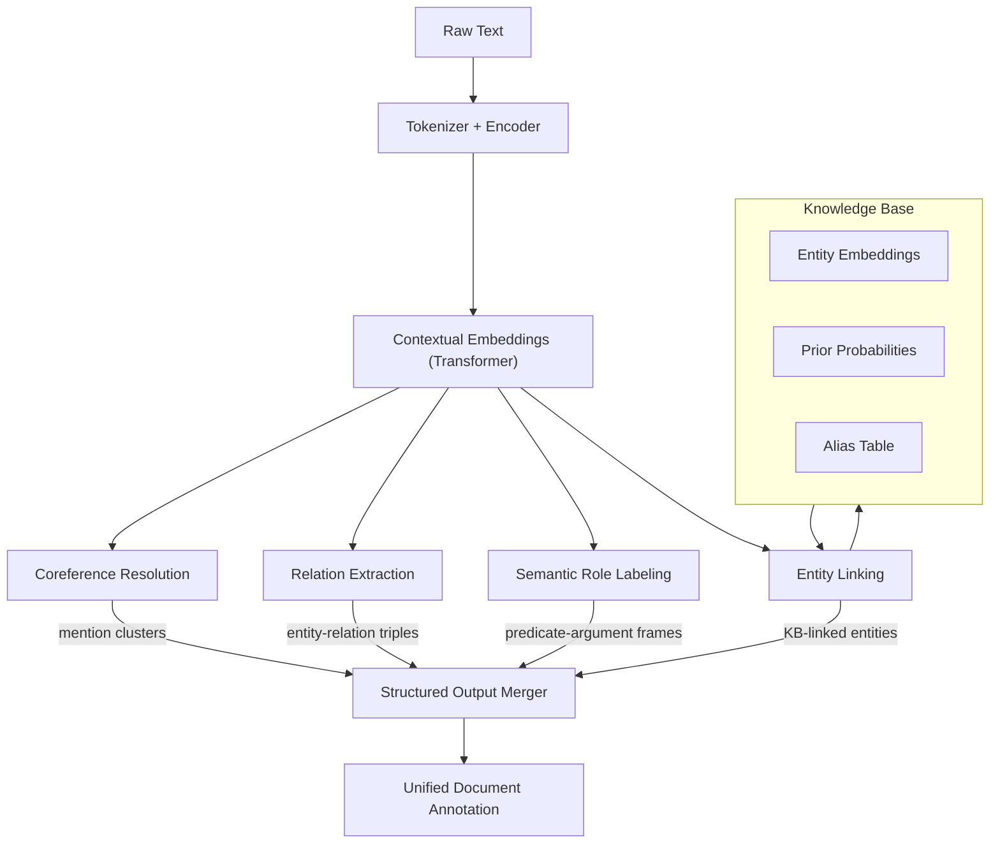
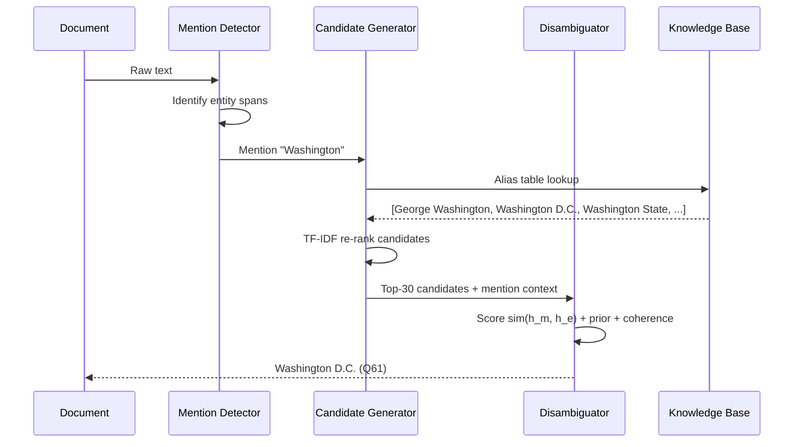
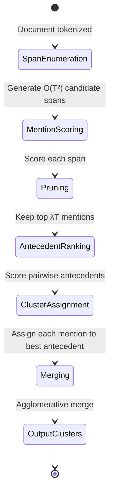

# Advanced NLU Toolkit

A deep natural language understanding pipeline implementing coreference resolution, relation extraction, semantic role labeling (SRL), and entity linking. Goes beyond surface-level NER to extract structured knowledge from unstructured text — who did what to whom, which mentions refer to the same entity, and how entities relate.

## Theory & Background

### Why Deep NLU Matters

Named entity recognition tells you that "Marie Curie" is a person and "radium" is a chemical element. But it cannot tell you that "She" in the next sentence refers to Marie Curie, that she *discovered* radium (not just that both appear in the text), or that "Marie Curie" maps to the specific Wikidata entity Q7186. Deep NLU closes these gaps. It turns flat text into structured knowledge: entity clusters, relation triples, predicate-argument frames, and knowledge base links. This is the foundation for question answering, knowledge graph construction, and document understanding at scale.

### Coreference Resolution

Coreference resolution identifies all expressions (mentions) in a text that refer to the same real-world entity and groups them into clusters. In "Marie Curie discovered radium. She won two Nobel Prizes," the mentions "Marie Curie" and "She" are coreferent. Getting this right is essential — downstream tasks like relation extraction and entity linking need to know which mentions are about the same thing.

Modern coreference resolvers use an end-to-end mention-ranking approach (Lee et al., 2017). Given a document with $T$ tokens, the model first scores all spans as potential mentions, then for each mention $m_i$, scores all antecedent candidates $m_j$ where $j < i$. The total score for linking mention $i$ to antecedent $j$ combines three signals:

```math
s(i, j) = s_m(i) + s_m(j) + s_a(i, j)
```

Here $s_m(i)$ is the mention score — how likely is span $i$ to be a valid mention at all? And $s_a(i, j)$ is the antecedent score — given that both are mentions, do they refer to the same entity? The antecedent score is computed from learned span representations:

```math
s_a(i, j) = \text{FFNN}_a\!\left([\mathbf{g}_i, \mathbf{g}_j, \mathbf{g}_i \circ \mathbf{g}_j, \phi(i, j)]\right)
```

where $\mathbf{g}_i$ is the span representation from a pretrained encoder, $\circ$ is element-wise product (capturing multiplicative interaction between spans), and $\phi(i, j)$ encodes distance and speaker features. The model considers $O(T^2)$ candidate spans, so aggressive pruning to the top $\lambda T$ spans is critical for tractability.

### Relation Extraction

Relation extraction identifies semantic relationships between entity pairs in text. Given a sentence with two marked entities, the model classifies the relation type (or "no relation"). This is what turns "Einstein was born in Ulm" into the structured triple `(Einstein, bornIn, Ulm)`.

For span-based extraction, the model encodes the sentence and entity spans, then classifies:

```math
P(r \mid e_1, e_2, \mathbf{c}) = \text{softmax}\!\left(\mathbf{W}_r [\mathbf{h}_{e_1}; \mathbf{h}_{e_2}; \mathbf{h}_{e_1} \circ \mathbf{h}_{e_2}] + \mathbf{b}_r\right)
```

where $\mathbf{h}_{e_1}$ and $\mathbf{h}_{e_2}$ are entity span representations from a transformer encoder and $\mathbf{c}$ is the sentence context. The element-wise product $\mathbf{h}_{e_1} \circ \mathbf{h}_{e_2}$ captures pairwise feature interactions without an explicit attention mechanism. The model handles multiple relations per entity pair and the common case of no relation (the "NA" class), which dominates most datasets — typically 80-90% of entity pairs have no relation.

### Semantic Role Labeling (SRL)

SRL answers "who did what to whom" by identifying the predicate-argument structure of each sentence. For each verb (predicate), SRL labels spans with roles: $\text{ARG0}$ (agent), $\text{ARG1}$ (patient), $\text{ARG2}$ (instrument), $\text{ARGM-TMP}$ (temporal), $\text{ARGM-LOC}$ (location), and others. This is the bridge between syntax and semantics — it captures meaning that dependency parsing alone cannot.

The BIO tagging approach treats SRL as sequence labeling. Given a predicate at position $p$, the model predicts a BIO tag for each token:

```math
P(y_t \mid \mathbf{x}, p) = \text{softmax}\!\left(\mathbf{W} \cdot \text{BiLSTM}([\mathbf{x}_t; \mathbf{v}_p])\right)
```

where $\mathbf{x}_t$ is the token representation and $\mathbf{v}_p$ is a predicate indicator embedding. Modern approaches use transformer encoders and span-based decoding instead of BIO tags, which avoids the structural constraint issues of BIO (e.g., predicting I-ARG1 after B-ARG0).

### Entity Linking

Entity linking maps entity mentions in text to entries in a knowledge base (e.g., Wikipedia/Wikidata). The challenge is ambiguity: "Washington" could be a person, a state, or a city. The pipeline has three stages: mention detection, candidate generation, and disambiguation.

Disambiguation scores each candidate entity against the mention context using a weighted combination of signals:

```math
\text{score}(m, e) = \alpha \cdot \text{sim}(\mathbf{h}_m, \mathbf{h}_e) + \beta \cdot P_{\text{prior}}(e \mid m) + \gamma \cdot \text{coherence}(e, \mathcal{E}_{\text{doc}})
```

where $\mathbf{h}_m$ is the contextual mention embedding, $\mathbf{h}_e$ is the entity embedding, $P_{\text{prior}}(e \mid m)$ is the prior probability of entity $e$ given mention string $m$ (from anchor text statistics), and $\text{coherence}(e, \mathcal{E}_{\text{doc}})$ measures compatibility with other entities already linked in the document. The prior alone resolves ~70% of mentions correctly; the contextual and coherence signals handle the hard cases.

### Tradeoffs and Alternatives

**Mention-ranking vs. mention-pair coreference**: The mention-ranking model (used here) scores each mention against all prior mentions and picks the best antecedent. The older mention-pair approach classifies each pair independently, then clusters. Mention-ranking is more accurate because it makes a global decision per mention, but it requires $O(T^2)$ comparisons. Cluster-ranking models (Lee et al., 2018) improve further by scoring against cluster representations, at the cost of more complex training.

**Pipeline vs. joint extraction**: This toolkit runs coreference, RE, SRL, and entity linking as separate modules with a final merger. Joint models that share representations across tasks can capture cross-task dependencies (e.g., coreference helps relation extraction), but they are harder to train, debug, and extend. The pipeline approach trades some accuracy for modularity — each component can be developed, tested, and swapped independently.

**BIO tagging vs. span-based SRL**: BIO tagging is simpler and works with any sequence labeler, but it enforces a strict non-overlapping constraint and struggles with discontinuous arguments. Span-based SRL enumerates candidate spans and classifies each, handling overlapping and nested arguments naturally. The cost is $O(T^2)$ candidate spans, mitigated by the same pruning strategy used in coreference.

**Entity linking candidate generation**: The alias table + TF-IDF approach used here is fast and interpretable. Dense retrieval (bi-encoder over entity descriptions) is more robust to surface form variation but requires precomputing embeddings for all KB entities — expensive for large KBs. This engine uses dense retrieval only as a fallback when the alias table returns too few candidates.

### Pipeline Architecture



### Entity Linking Disambiguation Flow



### Coreference Mention Lifecycle



### NLU Pipeline Processing Timeline

```mermaid
gantt
    title Document Processing Pipeline
    dateFormat X
    axisFormat %s

    section Shared Encoding
        Tokenization           :0, 1
        Transformer forward pass :1, 3

    section Coreference
        Span enumeration       :3, 4
        Mention scoring + pruning :4, 5
        Antecedent ranking     :5, 7

    section Relation Extraction
        Entity pair generation :3, 4
        Pair classification    :4, 6

    section SRL
        Predicate detection    :3, 4
        Argument labeling      :4, 6

    section Entity Linking
        Candidate generation   :3, 5
        Disambiguation         :5, 7

    section Merge
        Cross-task alignment   :7, 8
        Output assembly        :8, 9
```



### Key References

- Lee et al., "End-to-end Neural Coreference Resolution" (2017) — [arXiv:1707.07045](https://arxiv.org/abs/1707.07045)
- Joshi et al., "SpanBERT: Improving Pre-training by Representing and Predicting Spans" (2020) — [arXiv:1907.10529](https://arxiv.org/abs/1907.10529)
- Shi & Lin, "Simple BERT Models for Relation Extraction and Semantic Role Labeling" (2019) — [arXiv:1904.05255](https://arxiv.org/abs/1904.05255)
- Wu et al., "Zero-shot Entity Linking by Reading Entity Descriptions" (2020) — [arXiv:1906.07348](https://arxiv.org/abs/1906.07348)
- He et al., "Deep Semantic Role Labeling: What Works and What's Next" (2017) — [ACL](https://aclanthology.org/P17-1044/)

## Real-World Applications

Deep NLU transforms unstructured documents into structured, queryable knowledge. Organizations that deal with large volumes of text — contracts, clinical notes, intelligence reports, customer feedback — use these techniques to extract facts, relationships, and meaning that would take humans weeks to compile manually.

| Industry | Use Case | Impact |
|----------|----------|--------|
| Legal | Analyzing contracts to extract party relationships, obligations, and cross-references across thousands of pages | Reduces contract review time by 60-80%, catches obligation conflicts that manual review misses |
| Healthcare | Processing clinical notes to identify patient conditions, treatments, and outcomes linked to medical ontologies | Enables population-level health analytics and clinical decision support from unstructured EHR data |
| Intelligence | Exploiting document collections to build entity networks, track relationships, and resolve aliases across sources | Accelerates analyst workflows from days to hours, surfaces hidden connections across fragmented reports |
| Publishing | Auto-tagging articles with structured metadata: topics, people, organizations, and their relationships | Powers recommendation engines and semantic search, increasing reader engagement by 25-35% |
| Customer Experience | Extracting product issues, feature requests, and sentiment from support tickets and reviews at scale | Identifies emerging product problems weeks earlier than manual triage, prioritizes engineering fixes by impact |

## Project Structure

```
advanced-nlu-toolkit/
├── src/
│   ├── __init__.py
│   ├── coreference/
│   │   ├── __init__.py
│   │   ├── mention_detector.py    # Span enumeration and mention scoring
│   │   ├── coref_model.py         # End-to-end coreference with antecedent ranking
│   │   └── cluster_merger.py      # Agglomerative mention clustering
│   ├── relations/
│   │   ├── __init__.py
│   │   ├── extractor.py           # Span-pair relation classifier
│   │   ├── dataset.py             # Relation extraction dataset with negative sampling
│   │   └── typing.py              # Fine-grained entity typing for relation filtering
│   ├── srl/
│   │   ├── __init__.py
│   │   ├── predicate_detector.py  # Verb/predicate identification
│   │   ├── labeler.py             # BIO / span-based argument labeling
│   │   └── frame_builder.py       # Predicate-argument frame construction
│   └── linking/
│       ├── __init__.py
│       ├── mention_detector.py    # Named entity mention detection
│       ├── candidate_generator.py # Alias table + TF-IDF candidate retrieval
│       ├── disambiguator.py       # Bi-encoder entity disambiguation
│       └── kb_index.py            # Knowledge base entity index
├── configs/
├── data/
│   └── sample_docs/
├── requirements.txt
├── .gitignore
└── README.md
```

## Quick Start

```bash
pip install -r requirements.txt

# Run coreference resolution
python -m src.coreference.coref_model --input data/sample_docs/article.txt

# Extract relations
python -m src.relations.extractor --input data/sample_docs/article.txt --schema configs/relation_types.yaml

# Run semantic role labeling
python -m src.srl.labeler --input data/sample_docs/article.txt

# Link entities to knowledge base
python -m src.linking.disambiguator --input data/sample_docs/article.txt --kb data/kb_index/
```

## Implementation Details

### What makes this non-trivial

- **Span enumeration scaling**: Coreference considers $O(T^2)$ candidate spans for a document of $T$ tokens. The mention scorer aggressively prunes to the top $\lambda T$ spans before computing pairwise antecedent scores, keeping the quadratic cost manageable.
- **Negative relation sampling**: Most entity pairs in a sentence have no relation. The dataset builder uses type-constrained negative sampling — only pairing entities whose types are compatible with at least one relation schema — to avoid overwhelming the model with trivial negatives.
- **Predicate sense disambiguation**: SRL requires identifying which sense of a verb is active (e.g., "run a company" vs. "run a marathon"). The predicate detector uses contextualized embeddings to select the correct PropBank frame before argument labeling.
- **Candidate generation efficiency**: Entity linking over a large KB (millions of entities) requires fast candidate retrieval. The candidate generator combines an alias table (exact and fuzzy string match) with TF-IDF over entity descriptions, returning ~30 candidates per mention for the disambiguator to re-rank.
- **Cross-task coherence**: The output merger resolves conflicts between modules — for example, ensuring that coreferent mentions are linked to the same KB entity, and that SRL arguments align with detected entity spans.
